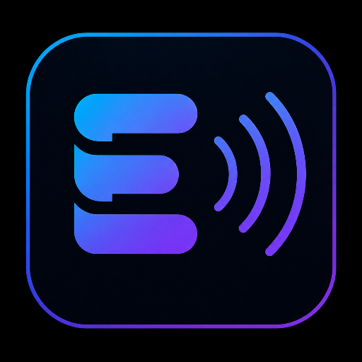

# <div align="center">



# EchoSight

### **See Beyond. Hear the Path.**

**An AI-powered accessibility companion empowering visually impaired individuals through intelligent navigation, environmental understanding, and assistive vision.**

---


---

**🏆 HackVerse 2026 Submission**
**🎯 Theme: Open Innovation**

</div>

---

> ## 🔑 For Judges — Quick Setup
>
> When you open the app, go to **Settings** and paste the following API key in the **Groq API Key** field:
>
> ```
> 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
> ```
>
> Then select **Groq** as your AI Provider. That's it — the app is ready to use!

---

# Table of Contents

* Introduction
* Problem Statement
* Why EchoSight?
* Key Features
* System Architecture
* AI Workflow
* Project Highlights
* Tech Stack
* Installation Guide
* Future Roadmap

---

# Introduction

EchoSight is an AI-powered accessibility platform designed to improve independence, confidence, and safety for visually impaired individuals.

Rather than functioning as a traditional object detector, EchoSight interprets the surrounding environment, understands context, and delivers concise voice guidance that assists users in navigating everyday situations.

The application combines modern computer vision, multimodal AI, speech technologies, and accessibility-first design into a single mobile experience.

---

# Problem Statement

More than **2.2 billion people worldwide** experience some form of vision impairment.

Daily activities such as:

* Navigating unfamiliar environments
* Reading printed documents
* Identifying currency
* Understanding surrounding obstacles
* Responding during emergencies

remain difficult without assistance.

Existing assistive technologies often require expensive dedicated hardware or offer limited real-time contextual understanding.

EchoSight addresses these challenges by transforming an ordinary smartphone into an intelligent accessibility companion powered by Artificial Intelligence.

---

# Why EchoSight?

Unlike traditional object detection systems that simply identify individual objects, EchoSight focuses on **contextual understanding**.

Instead of saying:

> Chair

EchoSight understands the scene and provides guidance like:

> Chair ahead. Move slightly left.

This approach produces information that is significantly more useful for navigation and real-world decision making.

---

# Core Features

## 🧭 AI Navigation Assistant

Navigate confidently using intelligent environmental understanding.

### Features

* Real-time scene understanding
* Context-aware obstacle detection
* Directional navigation guidance
* Voice-assisted interaction
* Accessibility-first interface

---

## 📖 Read Text

Convert printed information into spoken guidance.

### Features

* Capture text using camera
* AI-powered text extraction
* Read aloud functionality
* Suitable for notices, signs, labels and documents

---

## 💵 Currency Reader

Recognize Indian currency notes instantly.

### Features

* Camera-based note recognition
* AI-assisted denomination detection
* Voice announcement
* High-contrast accessible interface

---

## 🚨 Emergency SOS

Designed for critical situations requiring immediate assistance.

### Features

* One-touch emergency activation
* Emergency contact workflow
* Location sharing interface
* Safety-focused user experience

---

## ⚙️ Accessibility Settings

Personalize the application according to user preferences.

### Includes

* Adjustable speech speed
* Voice volume controls
* Navigation guidance preferences
* Emergency contact configuration

---

# What Makes EchoSight Different?

Traditional accessibility applications usually solve **one** problem.

EchoSight integrates multiple assistive capabilities into a unified AI ecosystem.

| Traditional Apps       | EchoSight                      |
| ---------------------- | ------------------------------ |
| Object Detection       | Contextual Scene Understanding |
| Separate OCR Apps      | Integrated Text Reader         |
| Separate Currency Apps | Built-in Currency Recognition  |
| Limited Navigation     | AI-guided Assistance           |
| Multiple Applications  | Single Unified Experience      |

---

# System Architecture

```text
                    User
                      │
                      ▼
             EchoSight Mobile App
                      │
      ┌───────────────┼───────────────┐
      │               │               │
      ▼               ▼               ▼
 Navigation      Read Text      Currency Reader
      │               │               │
      └───────────────┼───────────────┘
                      ▼
              AI Processing Layer
                      │
        ┌─────────────┴─────────────┐
        │                           │
        ▼                           ▼
  Featherless AI            Vision Processing
        │                           │
        └─────────────┬─────────────┘
                      ▼
            Intelligent Response
                      │
         ┌────────────┴────────────┐
         ▼                         ▼
   Visual Feedback           Voice Guidance
```

---

# Design Philosophy

EchoSight is built around three guiding principles.

## Accessibility First

Every interaction is designed with accessibility as the primary objective rather than an afterthought.

---

## Simplicity

The interface minimizes cognitive load through:

* Large touch targets
* High contrast colors
* Minimal navigation depth
* Clear visual hierarchy

---

## Intelligent Assistance

The application focuses on delivering actionable guidance instead of overwhelming users with raw information.

---

# Project Highlights

* AI-powered accessibility platform
* Modern React Native architecture
* Modular service-based design
* Accessibility-first user experience
* Dark theme optimized for readability
* Context-aware navigation assistance
* Expandable architecture for future AI integrations

---

> **"Technology should remove barriers—not create them. EchoSight exists to make everyday navigation more accessible, independent, and human-centered."**

---

# 🛠 Technology Stack

EchoSight combines modern mobile development with Artificial Intelligence to deliver a fast, accessible, and scalable assistive application.

---

## Mobile Development

| Technology       | Purpose                                       |
| ---------------- | --------------------------------------------- |
| **React Native** | Cross-platform mobile application development |
| **Expo**         | Development framework and native tooling      |
| **Expo Router**  | File-based navigation and routing             |
| **TypeScript**   | Type-safe application development             |

---

## Artificial Intelligence

| Technology         | Purpose                                                   |
| ------------------ | --------------------------------------------------------- |
| **Featherless AI** | Vision understanding and intelligent scene interpretation |
| **Google Gemini**  | Multimodal reasoning and contextual AI assistance         |

---

## Native Capabilities

| Technology                 | Purpose                          |
| -------------------------- | -------------------------------- |
| **Vision Camera**          | Real-time camera integration     |
| **Expo Speech**            | Text-to-speech guidance          |
| **React Native Audio API** | Spatial audio playback           |
| **Device Sensors**         | Motion and accessibility support |

---

## State Management

| Technology  | Purpose                             |
| ----------- | ----------------------------------- |
| **Zustand** | Lightweight global state management |

---

## UI & Design

| Technology                  | Purpose                             |
| --------------------------- | ----------------------------------- |
| **Custom Design System**    | Consistent dark accessibility theme |
| **React Native Components** | Cross-platform responsive UI        |

---

# 📂 Project Structure

```text
EchoSight
│
├── assets/
│   ├── images/
│   ├── icons/
│   └── fonts/
│
├── src/
│   │
│   ├── app/
│   │   ├── index.tsx
│   │   ├── navigation.tsx
│   │   ├── read.tsx
│   │   ├── currency.tsx
│   │   ├── sos.tsx
│   │   └── settings.tsx
│   │
│   ├── components/
│   │
│   ├── services/
│   │
│   ├── hooks/
│   │
│   ├── store/
│   │
│   ├── constants/
│   │
│   └── utils/
│
├── app.json
├── eas.json
├── package.json
└── README.md
```

---

# 🧠 Project Architecture

EchoSight follows a modular service-oriented architecture where each layer is responsible for a single concern.

```text
                Presentation Layer
             (Screens & Components)
                       │
                       ▼
              Application Services
         Camera • AI • Audio • SOS
                       │
                       ▼
               Global State Layer
                  Zustand Store
                       │
                       ▼
             Native Device Features
        Camera • Speech • Sensors
                       │
                       ▼
                 AI Processing Layer
      Featherless AI • Gemini Models
```

Each layer is isolated, making the project easier to maintain, extend, and debug.

---

# 🤖 AI Processing Pipeline

The Navigation Assistant follows a structured AI workflow.

```text
User
 │
 ▼
Open Camera
 │
 ▼
Capture Current Frame
 │
 ▼
AI Vision Processing
 │
 ▼
Contextual Scene Understanding
 │
 ▼
Generate Navigation Guidance
 │
 ▼
Voice + Visual Feedback
```

Unlike traditional object detection systems, EchoSight focuses on contextual understanding rather than simply identifying objects.

For example,

Instead of:

> Chair

EchoSight provides:

> Chair ahead. Move slightly left.

This enables more meaningful assistance during navigation.

---

# ⚙ Application Workflow

```text
Launch Application
        │
        ▼
Select Feature
        │
 ┌──────┼─────────────┐
 │      │             │
 ▼      ▼             ▼
Navigation    Read Text    Currency Reader
 │             │             │
 ▼             ▼             ▼
AI Analysis  AI OCR     AI Recognition
 │             │             │
 └──────┬──────┴─────────────┘
        ▼
 Intelligent Response
        │
        ▼
 Visual + Voice Guidance
```

---

# 🚀 Getting Started

## 1. Clone the Repository

```bash
git clone https://github.com/your-username/EchoSight.git

cd EchoSight
```

---

## 2. Install Dependencies

```bash
npm install
```

---

## 3. Configure Environment Variables

Create a `.env` file in the project root.

```env
EXPO_PUBLIC_GEMINI_API_KEY=YOUR_API_KEY
```

Replace `YOUR_API_KEY` with your AI API key.

---

## 4. Install the App (For Judges)

We have provided a pre-built APK via EAS (Expo Application Services) so you can test the app immediately without any setup!

1. **Download the APK**: Download the `.apk` file provided with our submission.
2. **Install on Android**: Transfer the APK to your Android device and install it. (You may need to allow installation from "Unknown Sources" in your device settings).
3. **Open EchoSight**: Launch the app. The AI API keys are already pre-configured for your convenience, so you can start testing the features immediately!

---

## 5. Start Local Development Server (For Developers)

If you wish to run the project locally instead of using the pre-built APK:

```bash
npx expo start --dev-client
```

For building locally on Android:

```bash
npx expo run:android
```

---

# 📦 Build

Generate an Android APK using Expo Application Services (EAS).

```bash
eas build --platform android --profile preview
```

---

# 🔐 Environment Variables

| Variable                     | Description                                   |
| ---------------------------- | --------------------------------------------- |
| `EXPO_PUBLIC_GEMINI_API_KEY` | API key used for AI-powered vision processing |

> **Note:** Never commit your `.env` file or API keys to version control.

---

# 🎯 Engineering Principles

EchoSight is built around a few core engineering principles:

* **Modular Design** — Independent services for AI, audio, camera, and emergency workflows.
* **Accessibility First** — Every screen prioritizes usability for visually impaired users.
* **Scalability** — Features are organized to simplify future enhancements.
* **Maintainability** — Separation of UI, business logic, and native integrations improves readability and testing.
* **Extensibility** — New AI models, accessibility features, or assistive devices can be integrated with minimal architectural changes.

---

# 📈 Future Scalability

The current architecture is designed to support future enhancements such as:

* Indoor navigation
* Depth estimation
* Real-time object tracking
* Offline AI inference
* Smart glasses integration
* Wearable device support
* Cloud synchronization
* Multi-language voice guidance
* Personalized accessibility profiles

The modular architecture allows these capabilities to be added without significant restructuring of the existing codebase.

---

# 🛣 Roadmap

EchoSight is designed as a foundation for a next-generation accessibility platform. While the current version focuses on real-time navigation and visual assistance, the architecture supports future expansion into a comprehensive AI-powered ecosystem.

## Phase 1 — Foundation ✅

* AI Navigation Assistant
* Read Text
* Currency Reader
* Emergency SOS
* Accessibility Settings
* Voice Guidance
* Modern Dark UI

---

## Phase 2 — Enhanced Accessibility

* Real-time continuous navigation
* Indoor navigation support
* Depth estimation for obstacle distance
* Smarter contextual scene understanding
* Multi-language voice guidance
* Offline AI assistance

---

## Phase 3 — Intelligent Companion

* Personalized navigation preferences
* Trusted contact recognition
* Familiar place detection
* AI memory for frequently visited locations
* Smart route recommendations
* Custom voice profiles

---

## Phase 4 — Wearable Integration

* Smart Glasses compatibility
* Bluetooth earphone optimization
* Smartwatch emergency support
* Edge AI processing
* Low-latency wearable navigation

---

# 🌍 Vision

We believe accessibility should not depend on expensive specialized hardware.

Our vision is to make intelligent assistance available through devices people already own.

EchoSight aims to become a trusted AI companion that empowers visually impaired individuals to navigate, explore, and interact with the world more independently.

> **"Technology should reduce barriers, increase confidence, and empower independence."**

---

# 🔒 Privacy & Security

EchoSight is built with user privacy in mind.

* User data is not permanently stored by the application.
* Camera access is requested only when required.
* Microphone access is used only for accessibility-related features.
* Sensitive API keys are managed through environment variables.
* Permissions are requested transparently and only when necessary.

---

# 📊 Future Improvements

Potential enhancements include:

* Real-time object tracking
* AI-powered route planning
* Public transport assistance
* Indoor mapping
* Voice commands
* QR and barcode reading
* Document summarization
* Medication and product label reading
* Cloud synchronization
* Offline accessibility mode

---

# 🧪 Testing

The application has been evaluated across its core workflows, including:

* Navigation assistance
* Text reading
* Currency recognition
* Emergency SOS interface
* Accessibility settings
* User interface responsiveness

Future work includes expanded device compatibility testing and usability evaluations with visually impaired users.

---

# 🤝 Contributing

Contributions, ideas, and accessibility-focused improvements are welcome.

If you would like to contribute:

1. Fork the repository.
2. Create a feature branch.
3. Commit your changes.
4. Open a pull request with a clear description.

Constructive feedback and accessibility recommendations are always appreciated.

---

# 🏆 HackVerse 2026

**Event:** HackVerse 2026
**Theme:** Open Innovation

EchoSight was developed as a hackathon project to demonstrate how Artificial Intelligence can be applied to create meaningful, accessible, and inclusive technology for everyday life.

---

# 🙏 Acknowledgements

We would like to thank:

* The HackVerse organizing team for providing the opportunity to innovate.
* The open-source community for the incredible tools and libraries that made this project possible.
* Researchers and developers working in accessibility and assistive technology, whose work continues to inspire inclusive innovation.

---

# 📜 License

This repository is released under the **MIT License**.

You are free to use, modify, and distribute this project in accordance with the terms of the license.

See the `LICENSE` file for additional information.

---

# 💙 Final Note

EchoSight is more than a hackathon submission—it is an exploration of how Artificial Intelligence can make everyday technology more inclusive.

While this project represents an early prototype, it reflects a broader vision: leveraging AI to create practical, accessible tools that empower individuals with greater independence and confidence.

We hope EchoSight inspires continued innovation in accessibility and demonstrates the potential of thoughtful, human-centered technology.

---

<div align="center">

## ⭐ If you found this project interesting, consider giving it a star!

### **Built with ❤️ for HackVerse 2026**

**See Beyond. Hear the Path.**

</div>
